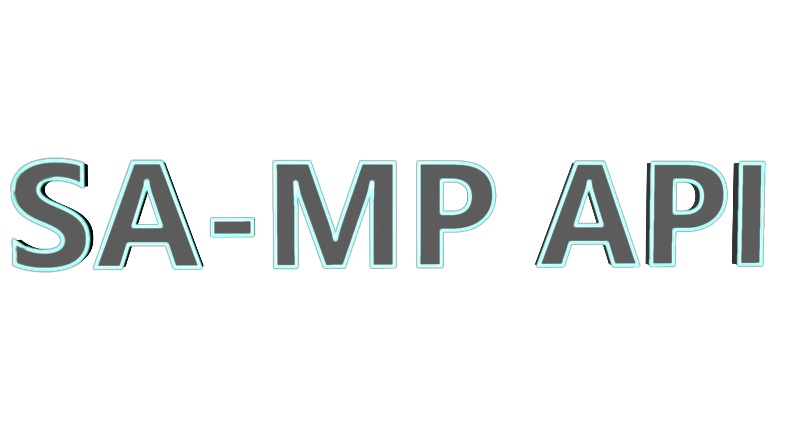

<!--  -->

## SA-MP API

Библиотека для взаимодействия с функциями, классами и структурами клиента SA-MP на языке _LUA_.

## Установка 

Чтобы установить последнию версию данной библиотеки, перейдите в [_Release_](https://github.com/Tim4ukys/SA-MP-API/releases/latest) и скачайте _source code_.
Далее просто откройте скачанный архив и переместите папку _"SA-MP API"_ в папку _lib_ в Вашем _Moonloader_.

# Авторы

[LUCHARE](https://github.com/LUCHARE) - автор оригинального SA-MP API.

[THE-FYP](https://www.blast.hk/members/2/), [imring](https://github.com/imring) - авторы мультиверсии.

[stereoliza](https://www.blast.hk/members/374442/) - автор lua версии.

[Tim4ukys](https://vk.com/tim4ukys) - автор доработки lua версии.
